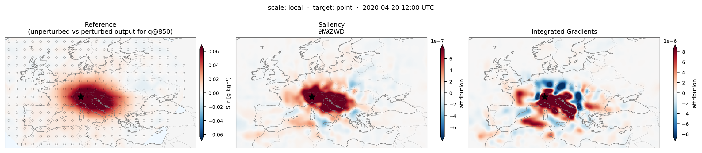

# ZWD attribution benchmark

This directory implements the localized intervention benchmark used to choose
an attribution method for the thesis. The most recent ZWD input, `t1`, is
perturbed by plus and minus one normalization standard deviation through
Gaussian searchlights. The signed half-difference of the two forecasts is the
reference response. Attribution maps are pooled through the same masks and
compared by magnitude Spearman correlation, signed Spearman correlation, and
NDCG@10.

The six-case manifest covers strong and secondary moisture events in
Ticino, California, and Japan. Local masks use a 2.5-degree width and stride;
synoptic masks use a 6-degree width and 5-degree stride. The thesis reports
6-hour box and point targets plus reduced-case 24-, 36-, and 72-hour point
rollouts. The long-lead case reduction must be stated when comparing leads.

The main six-hour box result favored saliency: magnitude correlation 0.733,
signed correlation 0.828, NDCG@10 0.995, and about three seconds per method
run. The single-case forward-method pilot used 1,200 RISE masks on a 72 by 144
grid and 4,096 ViT-CX clusters. The fixed-cluster ViT-CX option and optional
output smoothing in this copy match the final experiment code.

## Figure



*Intervention-based reference response (left), saliency (center), and
Integrated Gradients (right) for the Ticino case at a 36 h lead with local
masks (sigma = 2.5 degrees). Both methods localize the influential region, but
IG is less consistent in sign.*

## Versioned outputs

`results/6h_box/` and `results/6h_point/` contain the full aggregate rows,
configuration, and leaderboard JSON for the corrected-precision six-case
runs. The 24, 36, and 72 h directories retain the exact saliency and IG metric
JSON used in the rollout table, separated by case and spatial scale. The
strict-JSON `results/forward_method_pilot/complete_method_comparison.json`
records the 1,200-mask RISE and 4,096-cluster ViT-CX comparison. Together these
files provide the compact numerical record used to verify the reported values.

## Run

Prepare the dated ERA5 inputs if they are not already available:

```bash
python 02_zwd_attribution_benchmark/prepare_era5_for_cases.py \
  --cases 02_zwd_attribution_benchmark/cases_6h_eventdates.json
```

Run the six-hour box benchmark inside a GPU allocation:

```bash
python 02_zwd_attribution_benchmark/searchlight_benchmark.py \
  --cases 02_zwd_attribution_benchmark/cases_6h_eventdates.json \
  --methods saliency smoothgrad ig contrastive_saliency_global contrastive_ig_global \
  --scales local synoptic \
  --target-mode box \
  --lead-time-hours 6 \
  --output-dir results/zwd_attribution_benchmark/6h_box
```

For the reported Ticino forward-method pilot, use the strong-only manifest and
set `--rise-n-masks 1200 --rise-cells-h 72 --rise-cells-w 144
--vit-cx-stage 1 --vit-cx-n-clusters 4096` with methods `saliency ig rise
vit_cx` and the local scale.

`find_interesting_timestamps.py` reproduces the data-only event prescreen.
`generate_leaderboard.py` aggregates saved per-case outputs. Plotting helpers
under `visualize/` operate only on saved results.
