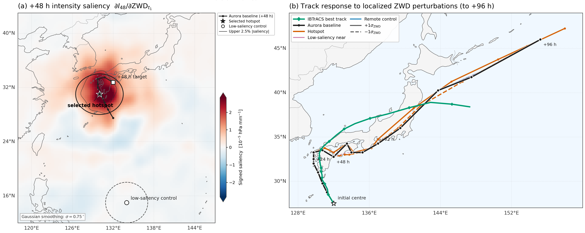
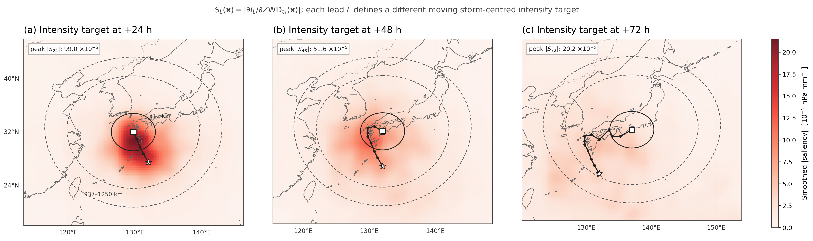

# Typhoon Nanmadol ZWD case study

This exploratory case study initializes Aurora at 2022-09-17 12:00 UTC and
traces Typhoon Nanmadol at six-hour intervals. It explains moving-window
intensity and position targets with respect to initialized ZWD, selects a
saliency hotspot plus matched low-near and remote controls, and applies finite
plus/minus-one- and two-sigma ZWD perturbations to those regions.

For the 48-hour intensity target, the hotspot is about 435 km from the initial
storm center. Its pooled saliency is 7.1 times that of the low-near control and
105.4 times that of the remote control. Hotspot perturbations produce the
largest intensity and late-track response. This demonstrates model-internal
relevance for one case; it is not a cyclone forecast benchmark.

## Figures



*ZWD attribution and perturbation analysis for Typhoon Nanmadol, initialized
on 2022-09-17 at 12:00 UTC. The left panel shows smoothed saliency for the
+48 h intensity target and the selected regions. The right panel compares the
IBTrACS best track with baseline and perturbed Aurora forecasts; hotspot
perturbations produce the clearest late-lead divergence.*



*Storm-centered sensitivity of the +24 h, +48 h, and +72 h intensity targets
to initialized ZWD. The star marks the initialized cyclone center, the squares
mark the lead-specific forecast target centers, and the circles indicate
distances of 312, 937, and 1,250 km from each target center.*

`results/storm_centered_xai/` versions the selected-region and saliency-summary
JSON, while `results/track_perturbation/summary.json` records the perturbation
setup. Machine-specific source paths were rewritten to repository-relative
paths; the measured values are unchanged. The JSON summaries accompany the
versioned IBTrACS rows used by the overlays.

## Run

Both model scripts require a GPU allocation:

```bash
python 05_nanmadol_zwd_case_study/storm_centered_xai.py --case nanmadol
python 05_nanmadol_zwd_case_study/track_perturbation.py --case nanmadol
```

They write under
`$AURORA_XAI_RESULTS_DIR/zwd_tc_case_study/nanmadol_2022091712_zwd_tc_case_study/`.
The plotting and verification scripts consume saved outputs and do not load
Aurora:

```bash
python 05_nanmadol_zwd_case_study/plot_thesis_figure.py
python 05_nanmadol_zwd_case_study/plot_saliency_evolution.py
python 05_nanmadol_zwd_case_study/verify_baseline_vs_besttrack.py
```

The curated IBTrACS v04r01 rows required for the overlays are versioned at
`data/nanmadol_ibtracs.csv`. The model scripts write saliency arrays, forecast
tracks, and perturbation trajectories beneath `AURORA_XAI_RESULTS_DIR`.
