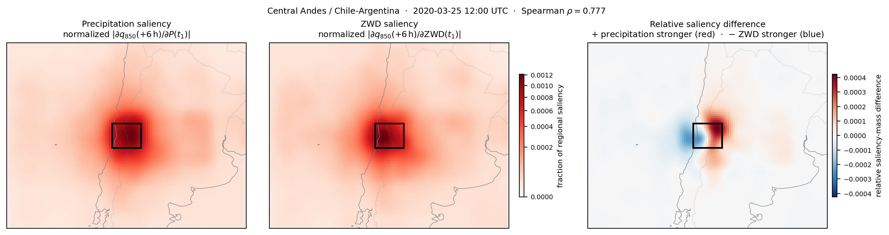

# ZWD and precipitation checkpoint comparison

This directory contains the controlled comparison between precipitation
checkpoints with and without a ZWD input. The final thesis localization uses 22
precipitation-event cases, one per target, and a one-step 850 hPa humidity box
target. Within the precipitation+ZWD checkpoint, absolute input-gradient
saliency with respect to precipitation and ZWD has a median spatial Spearman
correlation reported as 0.771 in the thesis. Directly taking the median of the
retained regenerated 22-row table gives 0.772; this 0.001 difference is below
the precision of the scientific interpretation but is recorded here rather
than hidden.

## Figure



*Unit-sum-normalized absolute input-gradient saliency of the +6 h 850 hPa
specific-humidity target with respect to precipitation (left) and ZWD (center)
in the precipitation+ZWD model for one representative target. Their signed
difference (right) reveals a small spatial offset within the otherwise shared
dominant sensitivity structure.*

`cases_diagnostic_22.json` fixes the exact final cohort.
`results/stage_b_reliance_summary.csv` is the versioned 22-row aggregate used
for the reported saliency alignment. `cases_precipitation.json` and
`select_precipitation_cases.py` preserve the underlying event-selection
workflow.

`results/ig_completeness/` contains the JSON emitted by the precipitation,
humidity-target, and 2 m temperature IG controls used in the numerical
validation appendix. The Stage-B comparison is recorded in its CSV aggregate.

## Run the saliency comparison

Run in a GPU allocation:

```bash
python 07_zwd_precipitation_model_comparison/model_conditional_comparison.py \
  --models precip_large_zwd \
  --cases 07_zwd_precipitation_model_comparison/cases_diagnostic_22.json \
  --stages B \
  --outputs q850 \
  --leads 6 \
  --diagnostic-cases-per-target 1 \
  --output-dir results/model_conditional_comparison
```

The Stage-B figure script expects `grid.npz` and `stage_b_reliance_maps/` under
the model subdirectory
`results/model_conditional_comparison/precip_large_zwd/`. IG completeness
checks for ZWD, humidity, and
2 m temperature in the fine-tuned checkpoints are retained because they
support the numerical-validation appendix. `test_units.py` exercises case
selection, intervention, and metric helpers without loading Aurora.
