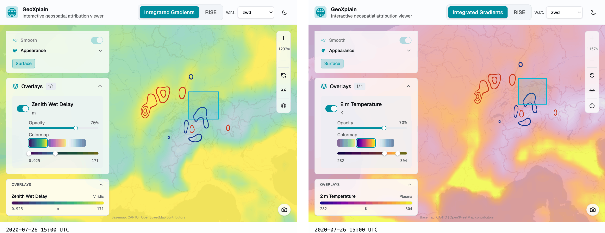
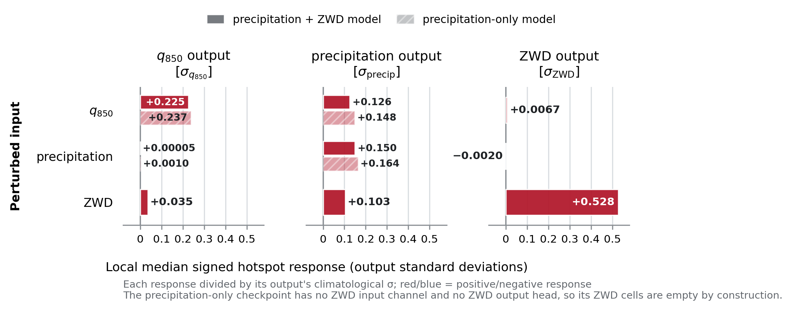

# Interpreting Aurora's moisture signals

This repository contains the experiments used to study how ZWD and MSWEP
precipitation are represented and used by fine-tuned Aurora checkpoints. It
also contains the GeoXplain Aurora adapter that exposes the attribution methods
through a reusable local and remote API.

The central conclusion is about model-internal sensitivity, not atmospheric
causality or forecast skill. ZWD behaves mainly as an additional
moisture-conditioning signal, while precipitation is used as a recent,
output-proximal event signal. Saliency is used for localization and is paired
with finite perturbations, physical counterfactuals, representation traces,
and activation patching.

## Selected figures



*GeoXplain places an Integrated Gradients explanation of a Zurich ZWD target in
physical context. The same attribution contours are shown over the input ZWD
field (left) and 2 m temperature (right).*



*Median local hotspot responses from the internal-routing experiment,
standardized by each output's climatological standard deviation. Solid bars
denote the precipitation+ZWD checkpoint and hatched bars the
precipitation-only checkpoint; its ZWD row and output are absent by design.*

## GeoXplain and the Aurora adapter

The interactive, model-agnostic visualization system is developed in the
[GeoXplain repository](https://github.com/clemenskoprolin/geoxplain) and
described in the full paper
[*GeoXplain: On-the-Fly Visual Explanations for Weather Foundation Models*](https://arxiv.org/abs/2607.05655).
The bundled [`geoxplain-aurora-adapter/`](geoxplain-aurora-adapter/) is the
Aurora-specific backend used to compute and serialize Saliency, Integrated
Gradients, RISE, and ViT-CX explanations. It retains its own package metadata,
tests, documentation, MIT license, and third-party notices.

## Repository map

| Directory | Thesis experiment |
|---|---|
| `xia_methods/` | Thesis implementations of saliency, SmoothGrad, IG, RISE, and ViT-CX |
| `01_attribution_method_validation/` | Completeness, randomization, stability, and RISE convergence |
| `02_zwd_attribution_benchmark/` | Localized ZWD intervention/searchlight benchmark |
| `03_zwd_moisture_relationships/` | 2020--2024 ZWD--humidity diagnostics |
| `04_zwd_counterfactual_interventions/` | 228-case native-TCWV counterfactual |
| `05_nanmadol_zwd_case_study/` | Storm-centered saliency and controlled ZWD perturbations |
| `06_precipitation_moisture_relationships/` | 2020 precipitation--moisture lag analysis |
| `07_zwd_precipitation_model_comparison/` | Controlled checkpoint and saliency comparison |
| `08_internal_routing_and_activation_patching/` | 22-case traces and unified eight-case patching |
| [`geoxplain-aurora-adapter/`](geoxplain-aurora-adapter/) | Installable Aurora attribution backend for GeoXplain |

Each directory has its own README with its scope, inputs, commands,
and expected outputs. Small case manifests and aggregate tables needed to
identify the thesis cohorts are versioned. Checkpoints, ERA5/WeatherBench2,
ZWDX, MSWEP, and per-case attribution arrays are not.

## Reproducibility outputs

Compact numerical outputs are versioned beside the experiment that produced
them. These are JSON summaries and tabular aggregates, not raw `.npy` or
`.npz` tensors.

| Directory | Versioned evidence |
|---|---|
| `01_attribution_method_validation/results/` | Completeness, randomization, stability, RISE convergence, and native-humidity controls in JSON |
| `02_zwd_attribution_benchmark/results/` | Six-hour aggregates, 24/36/72 h per-case metrics, and the forward-method pilot in JSON |
| `03_zwd_moisture_relationships/results/` | Ranked ZWD--moisture correlations in JSON |
| `04_zwd_counterfactual_interventions/results/` | Final 228-case responses and matching TCWV residuals in CSV, with JSON cohort manifests |
| `05_nanmadol_zwd_case_study/results/` | Selected regions and storm/perturbation summaries in JSON |
| `06_precipitation_moisture_relationships/results/` | Ranked precipitation--moisture correlations in JSON |
| `07_zwd_precipitation_model_comparison/results/` | Final Stage-B saliency aggregate in CSV and IG completeness controls in JSON |
| `08_internal_routing_and_activation_patching/results/` | Portable JSON run metadata and compact representation-trace and activation-patching CSVs |

The numerical values are preserved from the completed runs. In copied metadata,
machine-specific path fields were replaced with repository-relative paths or
the environment variables documented below. Non-applicable Python `NaN` tokens
were normalized to strict-JSON `null`. Each experiment README describes the
versioned files and their scope.

## Environment

Python 3.11 was used for the final experiments. Install the analysis
dependencies with:

```bash
python -m pip install -e '.[analysis]'
```

GPU experiments additionally require a CUDA-compatible PyTorch build and the
Aurora implementation used to train the modified checkpoints. Install that
Aurora package separately; this repository deliberately does not vendor a
model implementation or checkpoint.

The adapter is included as a Python package in this repository. Install its
lightweight client directly from the checkout with:

```bash
python -m pip install -e './geoxplain-aurora-adapter[client]'
```

See the [adapter installation guide](geoxplain-aurora-adapter/docs/installation.md)
for local GPU and listener deployments.

The scripts use repository-local `data/` and `results/` directories by default.
Large external inputs can be configured without editing code:

| Variable | Meaning |
|---|---|
| `AURORA_XAI_RESULTS_DIR` | Shared output root; defaults to `./results` |
| `AURORA_XAI_TMP_DIR` | Temporary searchlight arrays; defaults to `./.tmp/searchlight` |
| `AURORA_ERA5_CACHE_DIR` | Dated ERA5 NetCDF cache; defaults to `./data` |
| `AURORA_ZWD_DATA` | ZWDX-derived hourly ZWD Zarr store |
| `AURORA_WB2_STORES` | WeatherBench2 stores separated by `os.pathsep` (`:` on Linux) |
| `AURORA_MSWEP_DATA` | MSWEP 6-hour accumulation Zarr store |
| `AURORA_ZWD_CHECKPOINT` | ZWD-augmented Aurora checkpoint |
| `AURORA_PRECIP_ZWD_CHECKPOINT` | Precipitation+ZWD checkpoint |
| `AURORA_PRECIP_ONLY_CHECKPOINT` | Precipitation-only checkpoint |
| `AURORA_NORMALIZATION_STATS` | Normalization JSON; defaults to `config/normalization_stats_1979_2021.json` |

The original CSCS paths remain as fallbacks for the machine on which the
experiments were run. On another system, set the corresponding variables.

## Reproduction order

The directories are numbered in dependency order. The CPU/data-only
correlation analyses can run independently. GPU analyses reuse geometry and
loading helpers from earlier directories, and the routing analysis consumes
the saved Stage-B saliency maps from the checkpoint comparison. A minimal
verification that does not load Aurora (but does require PyTorch) is:

```bash
python -m compileall -q .
python 07_zwd_precipitation_model_comparison/test_units.py
python 08_internal_routing_and_activation_patching/test_units.py
python 08_internal_routing_and_activation_patching/activation_patching/test_activation_patch_units.py
```

The public-Aurora verification suite is included under
`geoxplain-aurora-adapter/diagnostics/`. GeoXplain itself remains in its
[dedicated repository](https://github.com/clemenskoprolin/geoxplain) and is not
vendored here.
